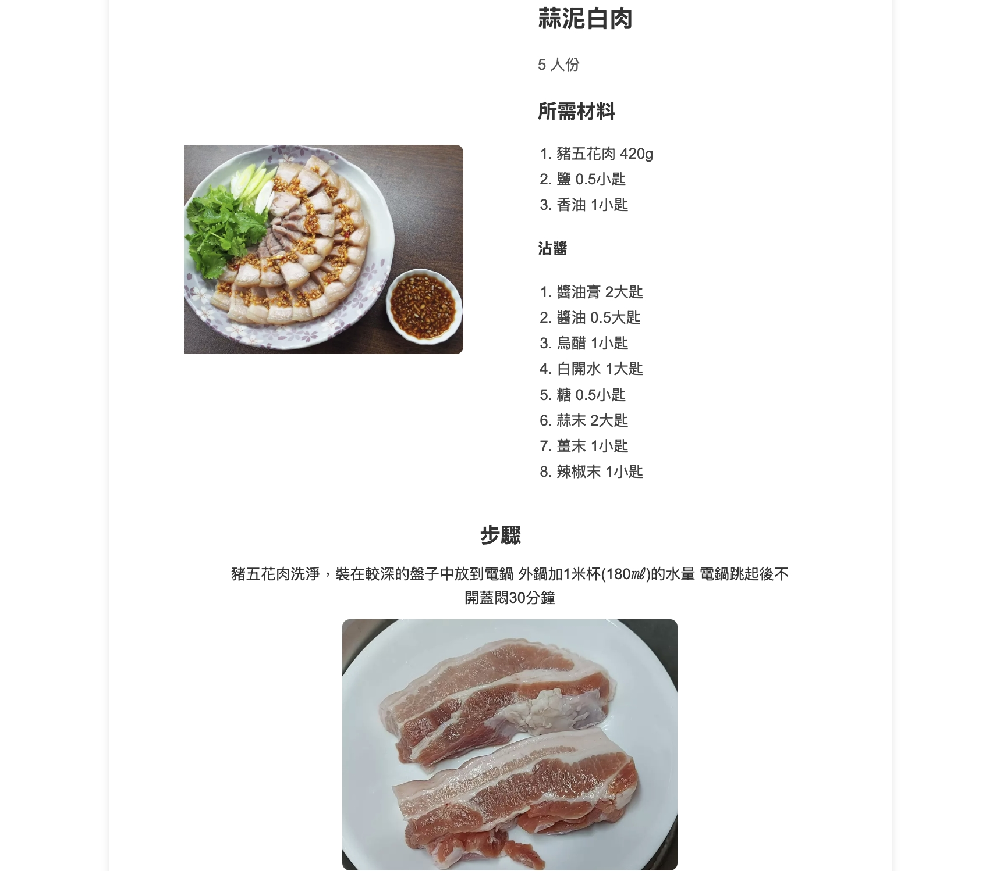

# 食譜應用程式

一個簡單的小網頁。
「今晚吃什麼？」不再是難題，這個網頁像轉蛋機一樣，隨機送上你從沒想過的驚喜料理，一秒解救選擇困難症！

## 功能特色

- 依類別瀏覽食譜：
  - 米飯料理
  - 麵食料理
  - 雞肉料理
  - 牛肉料理
  - 豬肉料理
  - 蛋類料理
  - 湯品
  - 甜點
- 「給我驚喜」選項提供隨機食譜建議

## 頁面展示

## 使用方法

1. 執行應用程式：`python app.py`
2. 在瀏覽器開啟 `http://localhost:5000`
3. 點擊任何食物類別以尋找食譜
4. 獲取所有你需要的詳細資訊：
   - 食譜標題和圖片
   - 份量
   - 食材清單
   - 步驟式烹飪說明

## 系統需求

- Python 3
- Flask
- BeautifulSoup4
- Requests

享受烹飪的樂趣！🍳
